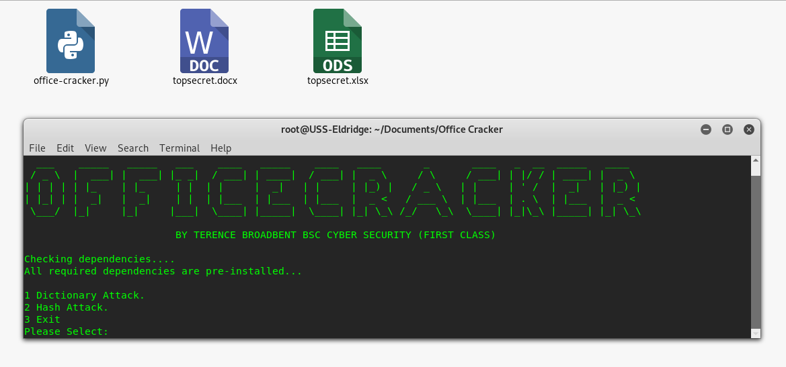

# OFFICE-CRACKER

python office-cracker.py topsecret.docx

Python script file to crack encrypted Microsoft files using bruteforce. The script is menu driven and allows the user to choose between a dictionary attack or a hash attack on the specified file.

