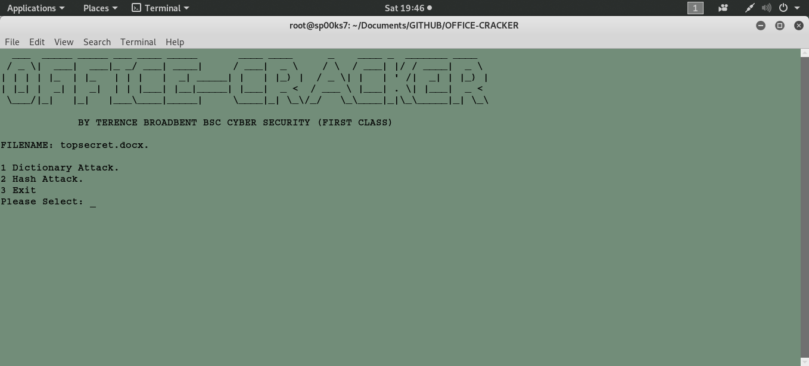

# OFFICE-CRACKER

python office-cracker.py topsecret.docx

| LANGUAGE | FILENAME | COMMAND |
|--------  |--------- |---------|
| python | office-cracker.py | secure.zip|
| |MD5 Hash - 745332e410d6c319f0f3b43117e21191 |

Python script file to crack encrypted Microsoft files using bruteforce. The script is menu driven and allows the user to choose between a dictionary attack or a hash attack on the specified file.

## CONSOLE DISPLAY

